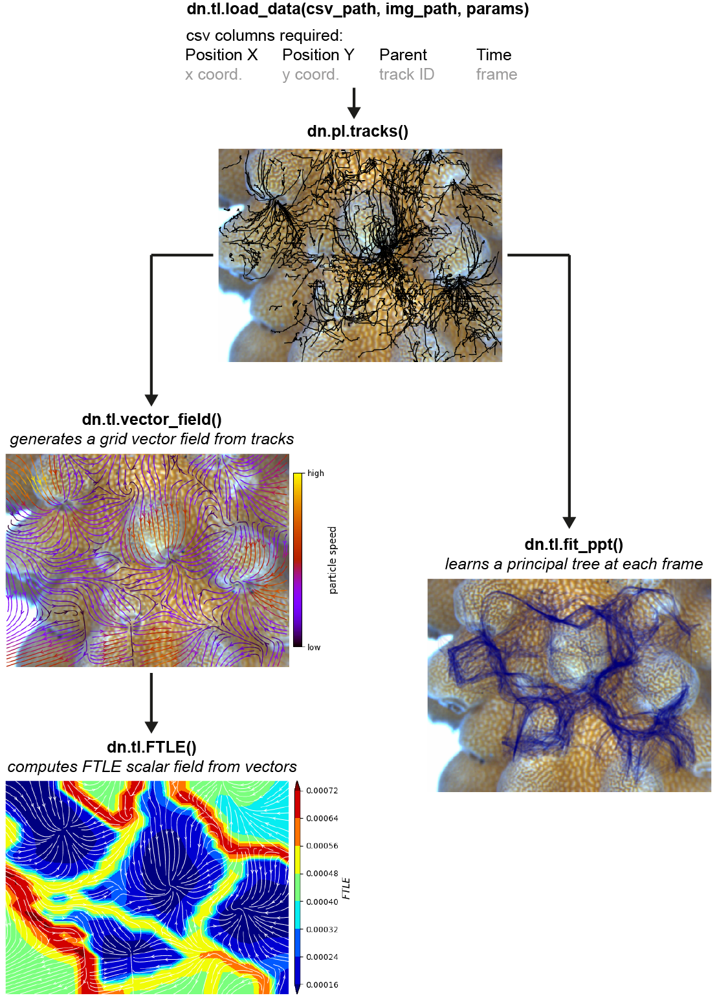

|PyPI| |Build & Test| |codecov| |License| |Code style: black|

dyntrack - a python package for analysis of particle dynamics
=============================================================

Python package for the study of particle dynamics from 2D tracks

Installation
------------

.. code:: bash

    pip install -U dyntrack

Usage
-----

.. code:: python

    import dyntrack as dt

    DT = dt.ut.load_data("tracks.csv","Position X","Position Y","Parent","Time","background.tiff")

    dt.tl.vector_field(DT)
    dt.pl.vector_field(DT)

    dt.tl.FTLE(DT, 20000,5)
    dt.pl.FTLE(DT)

    dt.tl.fit_ppt(DT,seed=1)
    dt.pl.fit_ppt(DT)

Workflow
--------

.. |PyPI| image:: https://img.shields.io/pypi/v/dyntrack.svg
   :target: https://pypi.python.org/pypi/dyntrack/
.. |Build & Test| image:: https://github.com/LouisFaure/dyntrack/actions/workflows/test.yml/badge.svg
   :target: https://github.com/LouisFaure/dyntrack/actions/workflows/test.yml
.. |codecov| image:: https://codecov.io/gh/LouisFaure/dyntrack/branch/main/graph/badge.svg
   :target: https://codecov.io/gh/LouisFaure/dyntrack
.. |License| image:: https://img.shields.io/badge/License-BSD%203--Clause-blue.svg
   :target: https://github.com/LouisFaure/dyntrack/blob/master/LICENSE
.. |Code style: black| image:: https://img.shields.io/badge/code%20style-black-000000.svg
   :target: https://github.com/psf/black

.. toctree::
   :maxdepth: 0
   :hidden:

   api
   references
